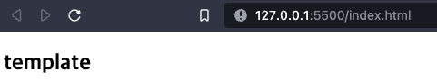
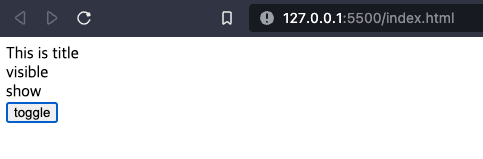
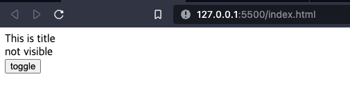

# vue란?

frontend 개발을 위한 javascript framework 중 하나

<br><br>
# 장점
특정 html tag 집합 단위로 분할하여 작업을 할 수 있다.<br>
여러 페이지에서 동일한 화면을 제공하는 경우, 같이 사용할 수 있다.<br>
새 페이지를 위한 서버 요청이 반복되지 않아 성능이 더 좋다.
  

# 사용
1. 아래와 같이 html에서 vue를 link한다.
```html
<!-- html -->
<!DOCTYPE html>
<html lang="en">
<head>
    <meta charset="UTF-8">
    <meta name="viewport" content="width=device-width, initial-scale=1.0">
    <title>Document</title>
    <script src="https://unpkg.com/vue@3.0.2"></script>
</head>
<body>
    <div id="app"></div>
    <script type="module" src="test.js"></script>
</body>
</html>
```

2. 아래와 같이 javascript파일에서 html의 tag를 연결하여 값을 세팅한다.
```ts
const app = Vue.createApp()(
{
  template:'<h2>template</h2>'
})

app.mount('#app') // app이라는 id에 연동
```

실행 시 아래와 같이 결과가 표시됨을 확인할 수 있다.<br>


<br><br>

# 문법
위와 같이 template를 사용할 수도 있고, 변수들을 사용한 가변 세팅도 가능하다.
javascript
* data(){return datas}
  * 데이터들을 정의한다
* methods:{functions}
  * 내부 값을 사용하는 함수들을 정의한다.
  * 렌더링 될 때 매번 호출된다.
* computed:{functions}
  * 내부 값을 가공하여 사용하는 함수들을 정의한다.
  * 반환되는 값이 자동으로 캐싱되어, 내부에 값 변경이 없으면 호출되지 않는다.

html tag
아래 각각은 html tag내에 들어가는 속성으로, javascript에서 정의된 값에 따라 동작이 달라지게 된다.
* v-on(@)
  * 동작에 대해 정의한다. 예를 들어 click일 경우 선택되었을 때 동작을 결정한다.
  * v-on 또는 @를 사용하여 정의할 수 있다.
    * @clock
    * @mouseover
    * @mouseleave
    * @dblclick
    * 
* v-if, v-else
  * element를 추가할지 결정한다. 조건이 맞지 않는 경우 element자체가 사라진다
* v-show
  * element를 보여줄지 결정한다.
  * 보여주지 않는 경우, tag는 남아있고 display만 되지 않는다.
* v-for
  * element를 반복할 때 사용한다.
    * ex) 
    * ```html
          <li v-for="object in lists">
          ...
          </li>
      ```
* v-bind(:)
  * html tag의 속성 값을 동적으로 변경할 때 사용한다.
  * bind 뒤에 설정된 속성이 값 변경에 따라 자동으로 변경되게 된다.
    * ex)
    * ```html
      
      ```
* 조건부 클래스
  * 조건부로 클래스의 값을 줄 때 사용한다. 아래 예시에서 object.isFav가 true일 경우 fav라는 class가 추가된다.
    * ex)
    * ```html
      <p :class="{ fav : object.isFav }">{{ object.text }}</p>
      ```


# 동작 예시
```html
<!DOCTYPE html>
<html lang="en">
<head>
    <meta charset="UTF-8">
    <meta name="viewport" content="width=device-width, initial-scale=1.0">
    <title>Document</title>
    <script src="https://unpkg.com/vue@3.0.2"></script>
</head>
<body>
    <div id="app">
        {{ title }}
        <div v-if="visible">visible</div>
        <div v-else>not visible</div>
        <div v-show="visible">show</div>
        <button @click="visible=!visible">toggle</button>
    </div>
        
    <script type="module" src="test.js"></script>
</body>
</html>
```

```ts
const app = Vue.createApp(
{
    //template:'<h2>template</h2>',
    data(){
        return {
            title:'This is title',
            visible:false
        }
    },
    methods:{
        ShowData(){
            this.visible=true;
        }
    }
})
    
app.mount('#app') // app이라는 id에 연동
```

toggle 버튼 선택에 따라 아래와 같이 표시되게 된다.<br>

